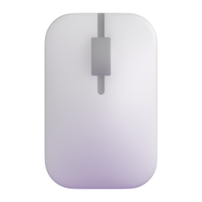

# Fluent Auto Clicker

Fluent Auto Clicker is a beautifully designed auto clicker for Windows 10 and 11. Following the latest Fluent Design guidelines and seamlessly blending into Windows.

We stand out as one of the fastest auto clickers, with a 1ms interval between clicks. Specially optimized for maximum clicking speed, clicking faster than even the most op auto clickers.

Whether you're playing games like Roblox, Minecraft, Cookie Clicker, or tackling any task that requires precise clicking, Fluent Auto Clicker has you covered.

<picture>
  <source media="(prefers-color-scheme: dark)" srcset="https://github.com/RyanLua/FluentAutoClicker/assets/80087248/eee955ac-4429-4262-ba84-48bf99c121d1">
  <source media="(prefers-color-scheme: light)" srcset="https://github.com/RyanLua/FluentAutoClicker/assets/80087248/ea30b709-fe74-4cec-b513-7aebf25d4270">
  
</picture>

## Features

|  | Fluent Auto Clicker | Others1 |
| --: | --- | --- |
| Fast Clicking | :ballot_box_with_check: | :ballot_box_with_check: |
| Custom Hotkeys | :ballot_box_with_check: | :ballot_box_with_check: |
| Low memory footprint | :ballot_box_with_check: | :ballot_box_with_check: |
| Fluent Design | :ballot_box_with_check: | :black_square_button: |
| Light & Dark Theme | :ballot_box_with_check: | :black_square_button: |
| Open-source | :ballot_box_with_check: | :black_square_button: |

### Lightning-Fast Clicking

Experience 1ms intervals between clicks, allowing for up to 1000 clicks per second.

### High Performance

Under 100MB of memory usage and a responsive user interface, Fluent Auto Clicker is exceptionally lightweight. No need to worry about it lagging down your computer.

### Fluent Design Light & Dark Theme

Enjoy automatic dark and light themes crafted with the latest Fluent Design guidelines.

### Safe & Secure

Fluent Auto Clicker is open-source, giving users full transparency about what's running on their computer. Other auto clickers are often closed-source, meaning users can't even see the code they're running.

###### 1 From top 5 most downloaded auto clickers from Microsoft Store October 2023
