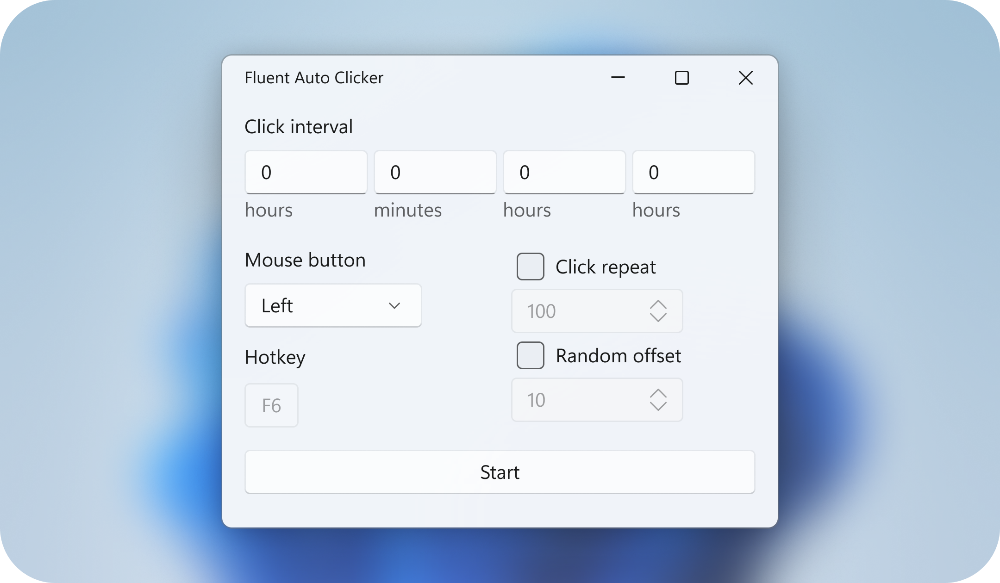

  
  <h1 align="center">Fluent Auto Clicker</h1>

  
  
  

> [!NOTE]
> Fluent Auto Clicker is still in development and there is no stable release of it yet
>
> Consider [starring the repository](https://docs.github.com/en/get-started/exploring-projects-on-github/saving-repositories-with-stars) to support it's development

Fluent Auto Clicker is a beautifully designed auto clicker for Windows 10 and 11. Following the latest Fluent Design guidelines and seamlessly blending into Windows.

We stand out as one of the fastest auto clickers, with a 1ms interval between clicks. Specially optimized for maximum clicking speed, clicking faster than even the most overpowered auto clickers.

Whether you're playing games like Roblox, Minecraft, Cookie Clicker, or tackling any task that requires precise clicking, Fluent Auto Clicker has you covered.

<picture>
  <source media="(prefers-color-scheme: dark)" srcset="assets/ScreenshotDark.png">
  <source media="(prefers-color-scheme: light)" srcset="assets/ScreenshotLight.png">
  
</picture>

## Features

|  | Fluent Auto Clicker | Others1 |
| --: | --- | --- |
| Fast Clicking | :ballot_box_with_check: | :ballot_box_with_check: |
| Custom Hotkeys | :ballot_box_with_check: | :ballot_box_with_check: |
| Low memory footprint | :ballot_box_with_check: | :ballot_box_with_check: |
| Fluent Design | :ballot_box_with_check: | :black_square_button: |
| Light & Dark Theme | :ballot_box_with_check: | :black_square_button: |
| Open-source | :ballot_box_with_check: | :black_square_button: |

### Lightning-Fast Clicking

Experience 1ms intervals between clicks, allowing for up to 1000 clicks per second.

### High Performance

Under 100MB of memory usage and a responsive user interface, Fluent Auto Clicker is exceptionally lightweight. No need to worry about it lagging down your computer.

### Fluent Design Light & Dark Theme

Enjoy automatic dark and light themes crafted with the latest Fluent Design guidelines.

### Safe & Secure

Fluent Auto Clicker is open-source, giving users full transparency about what's running on their computer. Other auto clickers are often closed-source, meaning users can't even see the code they're running.

## Contributing

We welcome contributions from everyone. Before contributing, read the [contribution guidelines](https://github.com/RyanLua/FluentAutoClicker/blob/main/.github/CONTRIBUTING.md).

First-time contributor? Make your first contribution to this repository by tackling one a ["good first issue."](https://github.com/RyanLua/FluentAutoClicker/issues?q=is%3Aopen+is%3Aissue+label%3A%22good+first+issue%22)

More experienced? Consider checking out a ["help wanted issue."](https://github.com/RyanLua/FluentAutoClicker/issues?q=is%3Aopen+is%3Aissue+label%3A%22help+wanted%22)

## License

This program is free software: you can redistribute it and/or modify it under the terms of the GNU Affero General Public License as published by the Free Software Foundation, either version 3 of the License, or (at your option) any later version.

This program is distributed in the hope that it will be useful, but WITHOUT ANY WARRANTY; without even the implied warranty of MERCHANTABILITY or FITNESS FOR A PARTICULAR PURPOSE. See the GNU Affero General Public License for more details.

You should have received a copy of the GNU Affero General Public License along with this program. A copy of the GNU Affero General Public License is available in the [`COPYING`](COPYING) file in the root of this repository. If not, see <https://www.gnu.org/licenses/>.

###### 1 From the top 5 most downloaded auto clickers from Microsoft Store October 2023
